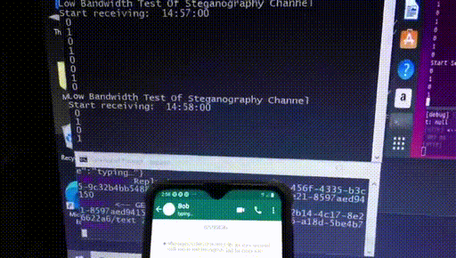

Covert channel in WhatsApp
--------------------------

Abstract
---------
"A covert channel is a path that can be used to transfer information in a way not intended by the system's designers. Typically the system has not given authorization for the transmission and has no knowledge of its occurrence."[1]

An example of a covert channel that can be found in a computer system at the lowest level is inside the CPU. In it, a sender will issue an instruction at some execution port eg., ALU to send a bit 1 and on the reciever side, the latency is measured to execute an instruction on the same port. If the latency is high, it means a 1-bit and 0-bit otherwise. This channel is used to stealthily transfer data between two processes of two different users.

Indeed, covert channels are proliferating as new communication applications and communication infrastructures are built. Presence of a covert channel weakness in messenger applications can effect the operational security of organizations. And for private users, its potential for illicit use can lead to loss of trust. If proper countermeasures are taken, the misuse of the system can be prevented and the prevention of this makes an application a more Trusted System.

In this article we take one(out of many) feature(s) of an exmaple messgenger application, whatsapp, and confirm low bandwidth steganography channel in it.  The sender and receiver automation test scripts for Android phones are developed and the corresponding video of the scripts in action is also shown.

Description
-----------
WhatsApp has a feature in it which can be used as a covert channel. WhatsApp messenger displays a “typing…” message on the destination user side when the source user starts typing a text. The message in green will be active for a certain period of time after the user stops typing. Even though the user actually wont send the text, we see this message. So, using this feature of WhatsApp, we can communicate using some encoding with the destined user without actually sending any text, and hopefully (?) without any trace.

Consider two users Alice and Bob who want to communicate secretly using binary encoding, i.e., 1s and 0s. When Alice wants to send a 1 to Bob, he will type a character and waits for some time. Bob will see a message “typing…” for a certain period of time. He stops for a “certain period of time” if he wants to send a 0.

If proper analysis is done to find out the timing of the message displayed and when it goes away, another app or a script with high bandwidth channel can be developed, which as a sender takes a text, encodes it and types characters in WhatsApp to send a message to Bob at proper time and at the receiver end looks at this message “typing…” spread across time. Using these the actual communication can happen by piggybacking on WhatsApp.

S/W used in the experiment:
---------------------------
Frameworks: appium ( test automation framework for Android apps), Selenium.

Python libraries: appium-python-client, selenium 

Other tools/software: adb, nodejs

OS: Windows Host OS ( for Phone1), Ubuntu Guest OS (for Phone 2)

Code:
-----
The two scripts, Sender:  and Receiver:  are a proof of concept of this covert channel. 
Preview of the video showing the scripts in action is: 

Impact:
-------
If this covert channel is taken care of, WhatsApp can be a more Trustworthy application for private (preventing illicit communication) and commercial communication(not involving in corporate espionage). Because ordinary private and commercial users cannot use/afford tapping mobile network data and its analysis under normal circumstances.

Conclusion:
----------
If this covert channel is considered risky by Whatsapp, it has the following potential options after being notified:

a) It can eliminate it by removing this "typing..." message display feature.

   Advantage: Removal of the covert channel
 
   Risk: The augmented reality is lost

b) It can reduce the bandwidth by introducing noise into the channel(by changing randomly the lenght of the time the "typing..." message is displayed)
 
   Advantage: Covert channel bandwidth is decreased, and it can become useless.

   Risk: There will be a slight change in the augmented reality

c) It can monitor it for patterns of usage that indicate someone is trying to exploit it and block the corresponding user."

   Advantage: The “typing...” augmentation of reality remains intact.
   
   Risk: Cumbersome per user blocking. [2]

References:
-----------
1. Common weakness enumeration, CWE-514: Covert Channel, https://cwe.mitre.org/data/definitions/514.html
2. CS329E: Spring, 2013: Elements of Security:Covert channels: 
 https://www.cs.utexas.edu/~byoung/cs329e/slides2b-covert-channels-4up.pdf
